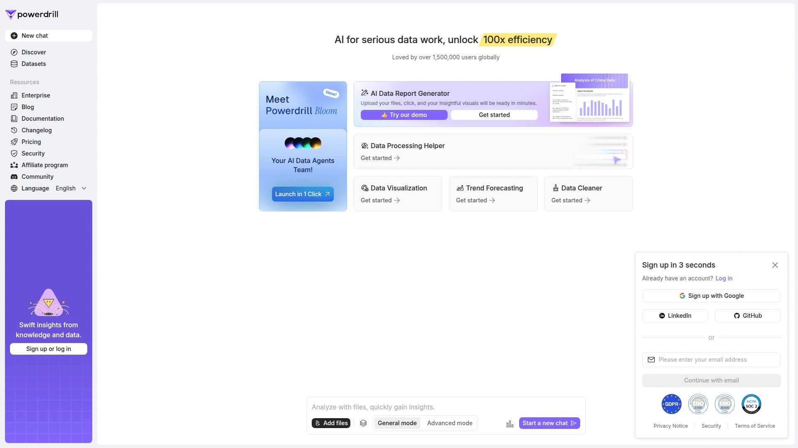

# 2025's Top 10 Best AI Data Analysis Tools

Manual data analysis eats hours that teams don't have. Spreadsheets overflow with numbers that hide the story. Business questions sit unanswered while analysts wrestle with SQL queries and chart formatting. AI data analysis tools transform this chaos by letting you ask questions in plain English, automatically generating visualizations, and uncovering insights that manual methods miss. These platforms handle everything from predictive modeling to real-time dashboards, making professional-grade analytics accessible regardless of technical background.

This compilation examines solutions built for modern data challenges—natural language queries that replace complex coding, automated report generation that saves hours, and intelligent pattern detection that reveals hidden opportunities across business operations.

***

## **[Powerdrill AI](https://powerdrill.ai)**

Natural language data analysis with one-click report generation and AI agent collaboration.

Powerdrill tackles the frustration of extracting meaning from raw datasets by combining conversational AI with automated visualization workflows. Upload Excel files, CSVs, PDFs, or connect SQL databases, then ask questions exactly how you'd phrase them to a colleague: "What were my top-performing products last quarter?" or "Show me customer churn trends by region". The platform understands context and delivers accurate answers without requiring SQL knowledge or formula expertise.

Powerdrill Bloom represents the platform's most innovative feature—four specialized AI agents working simultaneously on different analysis aspects. Eric handles data cleaning by transforming messy uploads into structured datasets. Anna deciphers user intent and identifies appropriate metrics for effective analysis. Derek enhances insights by incorporating external contexts like market trends and weather data. Victor verifies calculations, cross-references sources, and identifies discrepancies to ensure accuracy.

The AI Data Report Generator produces comprehensive visual reports in under a minute. Click one button after uploading files, and the system automatically analyzes patterns, creates relevant chart types, and generates actionable recommendations. These aren't generic visualizations—the AI intelligently detects data patterns and suggests optimal presentation formats. All visuals can be customized, saved to dashboards, and shared across teams.

Excel to PowerPoint conversion happens automatically when you upload spreadsheets or type topics. Powerdrill understands content structure and builds professional slides with charts and summaries. For students and researchers, the platform simplifies literature reviews by automatically summarizing research papers, extracting key arguments, and highlighting main points. Smart note-taking features group ideas by topic, identify key terms, and generate flashcards for easier revision.

Security compliance includes GDPR, ISO 27001, and SOC2 standards to protect sensitive information. The platform supports multimodal data processing including text-to-image, image-to-text, speech-to-text, and text-to-speech capabilities on Pro plans. Free tiers provide substantial functionality for testing workflows before upgrading. For teams needing fast insights without technical barriers, Powerdrill eliminates the coding requirement while maintaining analytical depth.

***

## **[Tableau AI](https://www.tableau.com)**

Enterprise business intelligence with Einstein Discovery predictive models and natural language queries.

Tableau revolutionized data visualization by making interactive dashboards accessible to non-technical users, and Tableau AI extends this democratization through generative AI capabilities integrated across the entire platform. The system lowers barriers to data-driven insights by providing smart, personalized, contextual recommendations right in users' workflow. Business users get actionable intelligence without leaving their analysis environment.

Ask Data functionality allows natural language questions that instantly generate visual answers. The system learns organizational language structure and CRM context, reducing time spent formulating technically precise queries. Einstein Discovery in Tableau enables users of any skill level to access predictions based on powerful models without writing algorithms. Anti-bias and transparency features ensure responsible, accurate, ethical AI usage.

Explain Data provides AI-driven explanations for individual data point values with single clicks. Advanced statistical models power these explanations, surfacing insights about anomalies or unexpected patterns directly within existing workflows. Forecasting automatically selects appropriate models based on data characteristics, accounting for trends and seasonality through exponential smoothing.

The platform integrates with R, Python, MATLAB, and other extensions to scale models and custom code across organizations. Augmented analytics capabilities range from automated modeling to guided natural language queries, empowering business users to discover insights independently. Third-party AI integrations work within existing analysis flows, eliminating disruption.

Tableau serves enterprises needing governed analytics with machine learning at scale. The visual analytics approach transforms how organizations use data to solve problems, with transparent AI that provides visibility into results so teams can confidently stand behind decisions. For companies requiring enterprise-grade business intelligence with embedded AI, Tableau delivers proven reliability across industries.

***

## **[Julius AI](https://julius.ai)**

Conversational data analysis designed specifically for analysts with automated exploratory insights.

Julius AI differentiates itself by being purpose-built for data analysis rather than a general chatbot that happens to understand math. Upload datasets and Julius immediately generates insights, charts, and summaries as a first-pass analysis. Think of it as an analyst sidekick providing quick exploratory overviews before formal work begins.

The step-by-step reasoning and execution approach handles complex analytical tasks through multiple stages. When running statistical tests to determine significant differences between model performances, Julius breaks the process into nine distinct steps, finding solutions when code errors occur and continuing execution automatically. This iterative problem-solving mimics how experienced analysts work through challenges.

Interactive and static plot generation serves different needs simultaneously. Static plots work perfectly for publications, while interactive versions allow data inspection, outlier examination, and zooming. Code visibility lets users copy and save procedures to repositories for documentation. The platform handles everything from simple plotting to complex hypothesis testing using appropriate statistical methods.

Practical applications span business reporting, financial forecasting, research analysis, and operational monitoring. Calculate average prices by category, compare conversion rates across channels, examine correlations between investments and returns, or measure statistical significance between groups—all through natural language queries. These capabilities make statistical analysis accessible without programming experience.

Julius works with Excel, CSV, and PDF data formats, turning file uploads into instant visual insights and automated reports. For data analysts needing a tool designed specifically for their workflow rather than adapted from general AI, Julius provides focused functionality that accelerates exploratory analysis and statistical testing.

***

## **[Microsoft Power BI](https://www.microsoft.com/en-us/power-platform/products/power-bi)**

Enterprise analytics with Azure AI integration and automated machine learning for business insights.

Power BI combines versatile reporting capabilities with advanced AI from Azure to create a platform suitable for data-driven decision-making across organizations. Seamless integration with Azure Machine Learning allows users to create, train, and deploy models directly within Power BI's environment. Built-in Azure AI services include text analytics for sentiment analysis and key phrase extraction, plus machine learning models that continuously learn and refine predictions.

AutoML (Automated Machine Learning) automates the entire process including data preprocessing, feature selection, model selection, and hyperparameter tuning. Business analysts can train, validate, and deploy machine learning models directly within Power BI without writing code. Select a target variable, and the system runs various statistical models like regression and random forest, generating detailed performance reports with validation results.

Predictive analytics capabilities extend beyond analyzing historical data to forecasting future outcomes based on past trends. This empowers businesses to set proactive strategies based on potential scenarios rather than merely reacting to developments. AI-automated decision-making analyzes historical choices, identifies patterns, and suggests optimal approaches for routine tasks.

Azure OpenAI integration enables natural language processing and AI-driven analysis. Through Python scripts within Power BI, users tap into Azure OpenAI to automate insight generation, commentary creation, and detailed data analyses. Copilot features prepare data for AI with new capabilities like AI data schemas, verified answers, and AI instructions.

Advanced analytics include key influencers analysis, decomposition trees, and anomaly detection to help discover new insights and inform decisions. For enterprises needing end-to-end analytics with customizable AI integrated into Microsoft's ecosystem, Power BI provides depth that scales from departmental reporting to organization-wide intelligence.

---

## **[Google Looker Studio](https://lookerstudio.google.com)**

Free data visualization tool with real-time updates and extensive third-party connector support.

Looker Studio (formerly Google Data Studio) transforms complex information into clear, customizable reports and dashboards that simplify interpretation through preferred visualizations. The platform brings data from multiple sources into unified views, making actionable insights accessible from raw information. Being completely free positions it as an accessible self-service business intelligence solution.

Visualization flexibility includes tables, pie charts, bar graphs, and numerous other formats with full customization of fonts, colors, and overall design. Client logo incorporation and branding personalization create professional presentations. Dynamic reporting means dashboards automatically update whenever original data sources change, ensuring information reflects current reality without manual intervention.

Connector availability extends beyond Google's ecosystem (Analytics 4, Ads, Sheets) to various third-party tools including CRMs, Meta Ads, LinkedIn Ads, and product analytics platforms. This broad compatibility lets businesses consolidate reporting from diverse systems into unified dashboards. Data blending and calculated fields enable advanced techniques for sophisticated analysis.

Collaboration features include permission-based sharing where users can view or edit reports based on designated access levels. Multiple team members can work on visualizations simultaneously, ensuring consistency across analytical outputs. Interactive charts allow drill-down by clicking dimension values, with filter controls refining displayed data by continent, region, channel, or custom parameters.

For marketers, agencies, and businesses needing customizable dashboards without software costs, Looker Studio delivers professional visualization capabilities with the reliability of Google's infrastructure. The platform excels at creating client-facing reports that automatically stay current.

***

## **[DataRobot](https://www.datarobot.com)**

Automated machine learning platform with 90%+ prediction accuracy across industries.

DataRobot revolutionizes machine learning by automating the entire workflow from data preparation to model deployment. The platform democratizes AI technologies by making them accessible without requiring deep coding knowledge or machine learning expertise. Drag-and-drop interfaces manage powerful functionality, automatically selecting optimal functions, algorithms, and parameter values for building models.

Model accuracy optimization happens through cutting-edge algorithms that eliminate guesswork and fine-tune models for maximum precision. By automatically selecting appropriate algorithms and hyperparameters for specific datasets, DataRobot ensures businesses can rely on robust predictive models delivering precise insights. Models have successfully predicted complex phenomena across finance, healthcare, retail, and manufacturing with average accuracy exceeding 90%.

Collaboration features foster knowledge sharing among data science teams. The platform enables insight sharing, project collaboration, and model experimentation, allowing data scientists to access and build upon colleagues' work. This accelerates machine learning model development and deployment by unlocking collective team intelligence. Survey data shows 85% of users report improved collaborative effectiveness on projects.

Responsible AI practices form core principles. The platform provides model transparency and interpretability so businesses understand prediction drivers and make informed decisions. Adherence to ethical AI principles ensures fairness, accountability, and robustness in developed models. Organizations can confidently deploy solutions that align with industry regulations and meet ethical standards, minimizing bias risk.

The company has received over $1 billion in investments from backers including Salesforce Ventures, BlackRock, Tiger Global Management, and Snowflake. Daily production reaches 2.5 million models with 3.74 billion total models released. For enterprises requiring industrial-strength automated machine learning with proven accuracy, DataRobot delivers institutional-grade capabilities.

***

## **[Domo](https://www.domo.com)**

Cloud-native AI platform with 1,000+ data connectors and customizable workflow automation.

Domo simplifies the entire data analytics lifecycle through a cloud-native, end-to-end platform combining powerful AI capabilities with built-in governance promoting responsible data use. Pre-trained AI models integrated within the platform let users quickly generate actionable insights without custom model training. AI-powered capabilities span the full analytics spectrum from real-time dashboards to predictive projections.

Integration breadth stands out with 1,000+ pre-built cloud and on-premises connectors enabling multi-cloud federated data access. Custom connections through APIs, SDKs, and webhooks provide flexibility beyond standard connectors. This connectivity consolidates disparate data sources into unified analysis environments.

AI agents function as tireless teammates automating tasks, adapting dynamically, and growing alongside businesses. Users build custom agents tailored to specific workflow needs with confidence in security and performance. Conversational AI embedded in content delivers natural interactions and personalized insights directly to end users. AI-assisted workflows overcome technical barriers with services handling everything from workflow creation to model forecasting.

Dashboard and visualization capabilities include 150+ chart types, 7,000+ custom map options, and drag-and-drop ad hoc analysis. Magic ETL provides visual data transformation through drag-and-drop flows, while SQL dataflows offer coded alternatives. Embedded analytics through Domo Everywhere deploys full-featured capabilities with appropriate security at scale.

Mobile-first design makes Domo the only vendor treating mobile as a first-class interface from inception. Nearly 500 CEOs use the platform and mobile app daily to run businesses. For enterprises needing comprehensive analytics with AI customization across the organization, Domo provides business intelligence that scales from analysts to executives.

***

## **[Sisense](https://www.sisense.com)**

Embedded analytics platform with AI-powered insights and centralized connection management.

Sisense delivers intelligent data analytics software with AI-powered capabilities and flexible deployment models suitable for various organizational requirements. After 2020, the platform expanded AI focus through tools including AI-driven alerts, predictive modeling connectors, and natural language search. Generative AI analytics capabilities provide smarter insights faster through advanced automation.

Deployment flexibility supports cloud, on-premises, and hybrid setups letting organizations access insights locally, remotely, and via mobile devices. This multi-environment approach accommodates different security requirements and infrastructure constraints. The platform connects large datasets from data warehouses, data lakes, and similar sources for comprehensive visualizations.

Centralized connection manager streamlines data source management by allowing teams to create, manage, and share connections securely from a single interface. This improves collaboration and reduces setup time when onboarding new data sources. Dashboard co-authoring enables multiple users to collaboratively build and edit dashboards in real-time, fostering teamwork and ensuring consistency.

The Analytical Engine serves as the default for new data models, offering improved query performance, accuracy, and support for advanced modeling techniques like calculated dimensions and left joins. This technical foundation ensures responsive analysis even with complex queries. Embedded analytics capabilities allow integration into customer-facing applications and portals.

AI and machine learning leverage artificial intelligence to automate analysis, providing predictive insights and natural language query capabilities. Users interact with data conversationally, deriving actionable intelligence through plain language questions. For businesses needing embedded analytics with AI enhancement, Sisense provides flexible architecture supporting diverse use cases.

---

## **[Qlik Sense](https://www.qlik.com/us/products/qlik-sense)**

Associative analytics engine with augmented intelligence and collaborative decision-making tools.

Qlik Sense provides on-premise modern analytics through an associative engine that reveals data relationships traditional query-based tools miss. This unique approach lets users freely explore data without being confined to predetermined paths, uncovering unexpected insights through natural curiosity-driven analysis. The associative model highlights connections between data points that filtered queries would hide.

Data preparation and connectivity features provide complete integration capabilities allowing work with nearly limitless data combinations both big and small. The data catalog offers well-governed, self-service access to all analytics-ready data, making it easy to find information and understand its origin and journey. Confidence in data usage comes from easily verifiable sources and lineage.

Application automation builds workflows and triggers event-driven actions in Qlik Sense and other cloud applications through visual, low-code environments. Broad connector libraries link to cloud applications enabling responsive process automation. Collaboration and notes features add narrative context to analytics, creating discussion threads for active data interaction.

Insight Advisor uses machine learning to automatically generate visualizations, charts, and analyses based on data characteristics. Users create analyses from analysis types, search-based exploration, or data selections with AI guidance suggesting appropriate visualization formats. Conversational analytics through Insight Advisor Chat makes apps available for natural language querying.

The platform scales from departmental analytics to enterprise-wide deployment with governance controls ensuring data security and compliance. For organizations needing associative exploration capabilities with augmented intelligence, Qlik Sense provides differentiated analytical approaches.

***

## **[Alteryx](https://www.alteryx.com)**

Drag-and-drop analytics automation with 300+ analytic building blocks and AI-guided workflows.

Alteryx powers analytics through easy end-to-end automation of data engineering, analytics, reporting, machine learning, and data science processes. The platform democratizes data analytics across organizations for broad use cases, serving 8,000+ customers and hundreds of thousands of users. Business users, data analysts, data scientists, and data engineers alike utilize Alteryx for high-value scenarios.

The drag-and-drop Designer interface features 300+ analytic building blocks allowing easy workflow creation and automation without coding. Visual workflow design lets users connect and configure data sources, tools, and outputs to create custom analytics processes. This intuitive approach puts data transformation power into business users' hands, enabling quick hypothesis testing and iteration.

Broad data connectivity spans traditional databases, cloud-based storage, and real-time streams. Out-of-box connectors work with SQL Server, Oracle, Google BigQuery, Amazon Redshift, and numerous other systems. Connection capability extends to structured and unstructured sources including Excel spreadsheets, CSV files, and social media platforms.

Data preparation and blending capabilities simplify processes through powerful tools enabling efficient data access, manipulation, analysis, and output without programming expertise. Users seamlessly join, union, or append data from multiple inputs whether structured or semi-structured. Advanced features like fuzzy matching and spatial joins enhance disparate data source blending.

Machine Learning capabilities through Alteryx AutoML and feature engineering enable business experts of any skill level to pursue high-value data science use cases. Auto Insights provides quick dashboards and storytelling applicable across organizations through AI capabilities. For teams needing visual analytics automation without coding barriers, Alteryx delivers comprehensive workflows.

***

## **[KNIME Analytics Platform](https://www.knime.com)**

Open-source data science with AI agents, 3,000+ analytical capabilities, and transparent workflows.

KNIME provides free, open-source analytics ensuring users remain on the bleeding edge of data science with 300+ data source connectors and integrations to all popular machine learning libraries. The open model has huge advantages integrating latest technologies while being cost-effective, with thousands of business users delivering value through automation of data-intense workflows.

K-AI serves as an AI agent collaborating on and building analytical workflows. Workflows provide transparent, documented summaries of every action performed on data, giving users trust in AI's work. This transparency differentiates KNIME from black-box AI solutions by showing exactly how conclusions were reached. The AI assistant generates data science workflows, visualizations, and code to upskill and onboard teams.

Access to all popular LLM providers, machine learning, predictive analytics, and over 3,000 analytical capabilities enables deep, meaningful insights without requiring coding. Some drag-and-drop tools for machine learning are limited, but KNIME's comprehensive capabilities give citizen data scientists the ability to create good models without programming languages while increasing actual data scientist bandwidth.

Governance and security features keep sensitive data safe through controls that monitor analytics and AI agents while verifying and explaining results. Collaboration support empowers enterprise-wide analytics with trusted workflows, advanced toolboxes, and secure governance de-risking AI innovation. The platform serves both technical specialists and business users through accessible interfaces.

Generative AI integration includes Large Language Model connectivity, prompt engineering, vector stores for Retrieval-Augmented Generation, and agent building—all within visual workflows. For organizations needing transparent, governable analytics with cutting-edge AI capabilities at no licensing cost, KNIME delivers institutional-grade analytics through open-source foundations.

***

## FAQ

**Can non-technical users really analyze data with these AI tools?**

Yes, modern AI data analysis platforms are specifically designed for natural language interaction. You can ask questions in plain English like "What were my best-selling products last month?" and get visual answers without SQL or coding knowledge. Tools like Powerdrill, Julius AI, and Tableau AI translate conversational queries into technical analysis automatically, making professional-grade analytics accessible to business users, marketers, and operations teams.

**How do AI data tools handle data security and privacy?**

Enterprise platforms implement rigorous security standards including GDPR compliance, ISO 27001 certification, and SOC2 audits. Data encryption protects information in transit and at rest, while role-based access controls limit who can view sensitive datasets. Many tools like Powerdrill and DataRobot undergo independent security audits to verify protection measures. For highly sensitive data, on-premise deployment options from vendors like Qlik Sense and Sisense keep information entirely within your infrastructure.

**What's the typical time savings from using AI-powered data analysis?**

Automated report generation that previously required hours now completes in under a minute with tools like Powerdrill. Statistical analysis that demanded programming expertise becomes conversational queries answered in seconds. DataRobot users report building and deploying machine learning models 10x faster than manual approaches. The combination of natural language queries, automated visualization, and AI-generated insights typically reduces analysis time by 60-80% while improving accuracy.

***

## Conclusion

Data analysis shouldn't require programming degrees or weeks spent formatting charts. Modern AI platforms eliminate technical barriers by understanding natural language, automatically generating insights, and producing publication-ready visualizations in minutes instead of hours. Whether you're forecasting business trends, exploring customer behavior, or building predictive models, these tools democratize analytics capabilities that were previously locked behind specialized expertise.

For teams seeking conversational data analysis with one-click report generation and specialized AI agents handling cleaning, verification, and insight discovery, **[Powerdrill AI](https://powerdrill.ai)** delivers accessible analytics without sacrificing depth. The platform transforms questions into answers and raw data into actionable intelligence through workflows designed for speed and clarity rather than complexity.
